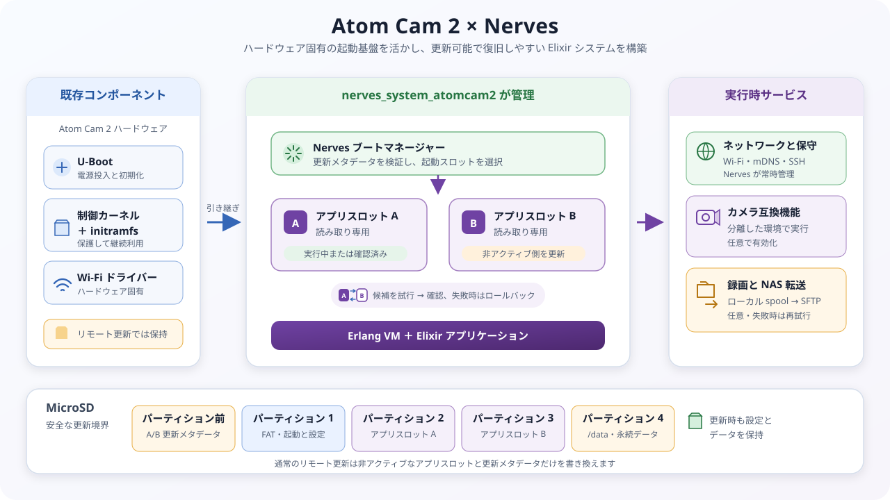

# nerves_system_atomcam2

Atom Cam 2 で Nerves を動かすための実験的な Nerves system です。

初めて利用する場合は[スタートガイド](docs/getting-started.md)から始めてください。
起動、更新、カメラ、録画の仕組みは
[アーキテクチャ概要](docs/architecture.md)で説明しています。

[](docs/architecture.md)

## 現在の状態

v0.3.0 は、クリーンなソースからのビルドと実機で次の動作を確認済みです。

```text
MicroSD から起動
  -> Nerves アプリを開始
  -> Wi-Fi に接続
  -> nerves.local を mDNS で通知
  -> SSH とターゲット IEx を開始
```

主な機能:

- Nerves の標準的なアプリケーション開発フロー
- VintageNet による Wi-Fi 接続、mDNS、SSH、ターゲット IEx
- `/data` の永続データ領域
- A/B スロットによるリモート更新とロールバック
- 標準 Atom モバイルアプリとの任意の互換機能
- 1 分単位の連続録画
- SFTP による NAS 転送、再試行、容量上限、保存期間の管理

カメラ互換機能と NAS 転送は初期状態では無効です。Nerves が起動、ネットワーク、
ハードウェア watchdog、更新、復旧を管理します。RTSP、Web UI、Samba、内蔵フラッシュ
への書き込みには対応していません。

> このプロジェクトは実験段階です。無人環境や重要な用途へ導入する前に、停電、
> クラッシュの反復、長時間運転、温度、ファイルシステム復旧を利用環境で検証して
> ください。

## クイックスタート

Atom Cam 2、MicroSD カード、Nerves 開発環境、2.4 GHz Wi-Fi、SSH 公開鍵を
用意します。

```sh
cd examples/atomcam2_nerves_app

export MIX_TARGET=atomcam2
export MIX_ENV=prod
export NERVES_WIFI_SSID="your-ssid"
export NERVES_WIFI_PASSPHRASE="your-passphrase"

mix setup
mix firmware.burn
```

`mix firmware.burn` は選択した MicroSD カードを消去します。fwup が表示する
デバイス名を確認してから書き込んでください。カードをカメラへ挿入して起動した後、
次のコマンドで接続を確認します。

```sh
ping nerves.local
ssh nerves@nerves.local
```

詳しい手順と任意機能の設定は
[サンプルアプリの README](examples/atomcam2_nerves_app/README.md)を参照してください。

## システムの構成

Atom Cam 2 固有の起動とハードウェア制御に必要な既存コンポーネントを限定して利用し、
その後のユーザー空間を Nerves が管理します。

```text
Atom Cam 2 の U-Boot と保護された制御カーネル
  -> Nerves のブートマネージャー
  -> アプリケーションスロット A または B
  -> Erlang VM と Elixir アプリケーション
```

通常のリモート更新は、実行中ではないスロットだけを書き換えます。新しい
ファームウェアがヘルスチェックに合格するまでは、直前に確認済みのスロットを
ロールバック先として保持します。Wi-Fi、SSH、永続データ、保護された制御カーネルは
リモート更新で書き換えません。

カメラ互換機能は、標準 Atom アプリに必要な既存のカメラバイナリを分離した環境で
任意に動かします。ネットワーク、watchdog、更新、再起動は引き続き Nerves が
管理するため、カメラ機能や NAS に障害が発生しても SSH と復旧経路を維持できます。

## Wi-Fi と SSH

ビルド時の `NERVES_WIFI_SSID` と `NERVES_WIFI_PASSPHRASE` は、MicroSD の
`nerves-provisioning.conf` に保存されます。SSH では通常 `~/.ssh/*.pub` の公開鍵を
使用します。鍵を指定する場合は、ビルド前に次を設定してください。

```sh
export ATOMCAM2_AUTHORIZED_KEYS="$HOME/.ssh/id_ed25519.pub"
```

認証情報を変更する場合は、FAT パーティションの `nerves-provisioning.conf` と
`authorized_keys` を編集できます。

## 関連文書

- [スタートガイド](docs/getting-started.md)
- [アーキテクチャ概要](docs/architecture.md)
- [サンプルアプリの設定と操作](examples/atomcam2_nerves_app/README.md)
- [変更履歴](CHANGELOG.md)
