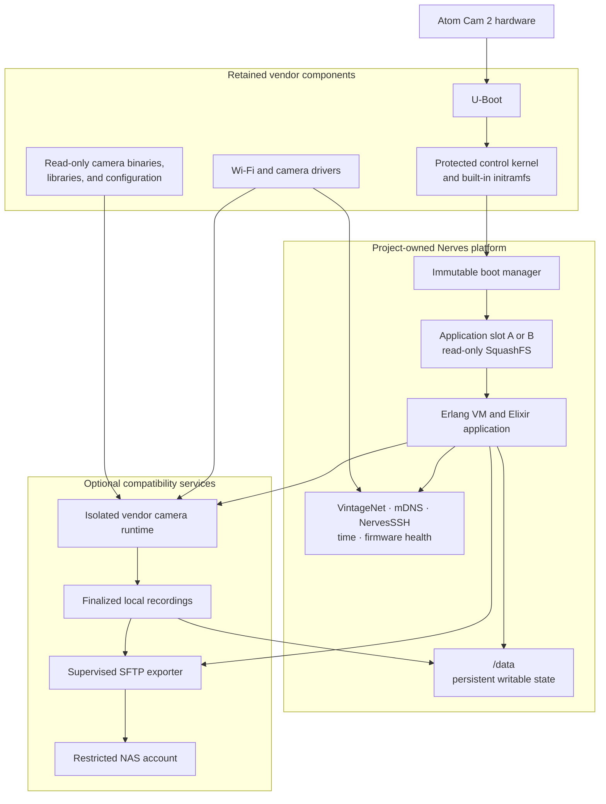
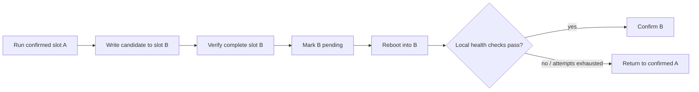
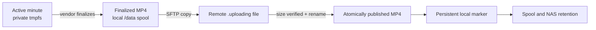

# Architecture overview

`nerves_system_atomcam2` is an experimental Nerves platform for Atom Cam 2. It
keeps the small set of vendor components needed to boot and operate the camera,
then hands control to a Nerves-generated Linux userspace and an Elixir
application.

The v0.3.0 MVP provides:

- a standard Nerves application build workflow;
- Wi-Fi, mDNS discovery, SSH, and target IEx;
- persistent application data under `/data`;
- A/B application firmware updates and rollback;
- optional compatibility with the standard Atom mobile application;
- continuous one-minute local recordings; and
- optional SFTP export to a NAS with retry, spool limits, and retention.

The camera compatibility and NAS exporter are disabled by default. The core
Nerves system remains useful and recoverable without either service.

For installation and the first device checks, follow
[Getting started](getting-started.md).

## The architecture in one picture



The most important boundary is:

```text
retained vendor boot and hardware components
                    |
                    v
        project-owned Nerves platform
                    |
                    v
       optional vendor compatibility
```

The project does not attempt to recreate the camera firmware from scratch or
adopt the complete `atomcam_tools` environment. It preserves proven,
hardware-specific pieces and owns the general userspace, application lifecycle,
and recovery behavior.

## Ownership boundaries

| Concern | Owner |
| --- | --- |
| Initial boot, protected kernel, built-in initramfs | Vendor components retained by the project |
| Boot-manager image, slot selection, rollback | `nerves_system_atomcam2` |
| Erlang VM, Elixir release, root filesystem | Nerves system and application |
| Wi-Fi, DHCP, DNS, mDNS, SSH, time | Nerves services |
| Hardware watchdog | Nerves `heart` |
| Camera capture, encoding, mobile protocol | Optional vendor runtime |
| Local spool, export retry, publication, retention | Nerves application |
| Writable application and compatibility state | `/data` |

These boundaries are deliberate. The vendor camera runtime does not own
networking, the watchdog, firmware updates, reboot policy, or the real MicroSD
block device. A camera or NAS failure therefore does not have to become a
device-management failure.

## Boot and storage

Atom Cam 2 expects vendor-specific filenames on the MicroSD boot partition. The
project uses that fixed handoff to enter a small boot manager, which then
selects a Nerves application slot.

```text
Power on
  -> U-Boot
  -> protected control kernel
  -> built-in vendor initramfs
  -> rootfs_hack.squashfs boot manager
  -> application slot A or B
  -> erlinit
  -> Erlang VM and Elixir release
```

The complete installation creates this media layout:

| Area | Contents | Routine OTA behavior |
| --- | --- | --- |
| Raw metadata before partition 1 | Two checksummed rollback records | Updated only after candidate verification |
| Partition 1 | FAT boot files and provisioning | Not rewritten |
| Partition 2 | Read-only application slot A | Written only when inactive |
| Partition 3 | Read-only application slot B | Written only when inactive |
| Partition 4 | ext2 mounted at `/data`; expands to fill media | Preserved |

Important files on the FAT partition are:

| File | Purpose |
| --- | --- |
| `factory_t31_ZMC6tiIDQN` | Protected control kernel |
| `rootfs_hack.squashfs` | Immutable Nerves boot manager |
| `hostname` | Initial hostname |
| `authorized_keys` | SSH authorization |
| `nerves-provisioning.conf` | Wi-Fi provisioning |

The boot manager is the adaptation between the vendor boot contract and Nerves
A/B firmware. The vendor initramfs only knows the fixed
`rootfs_hack.squashfs` filename; the boot manager knows how to validate metadata,
select a slot, decrement candidate attempts, and fall back to the confirmed
slot.

## Firmware lifecycle

Routine remote updates never overwrite the running firmware:



The redundant raw metadata records identify the active, confirmed, and pending
slots, the pending attempt count, firmware identifiers, and a monotonically
increasing generation. A metadata update writes the older record and leaves the
current valid record intact.

The candidate is confirmed only after the OTP application, `/data`, firmware
metadata, and local network subsystem are healthy for a stabilization period.
Internet reachability is not required to prove that firmware itself is sound.

There are two installation scopes:

| Operation | Command | May change |
| --- | --- | --- |
| Complete installation | `mix firmware.burn` | Entire MicroSD layout |
| Application update | `mix firmware && mix upload nerves.local` | Inactive slot and rollback metadata |

SSH public-key authentication controls access to the update endpoint. Fwup
checks archive and resource integrity, and the Atom Cam 2 updater additionally
checks platform, architecture, destination slot, and the written root
filesystem. Firmware signatures remain optional, matching the standard Nerves
baseline.

## Runtime supervision

The example application's target supervision tree uses `:one_for_one`:

```text
Atomcam2NervesApp.Supervisor
|
+-- TimeSync
+-- FirmwareHealth
+-- VendorCamera             optional boot worker
+-- NasExporter.SFTP         reusable transport session
+-- NasExporter              optional spool worker
```

Standard Nerves libraries start alongside the application:

- VintageNet owns `wlan0`, Wi-Fi association, and DHCP.
- `mdns_lite` advertises `nerves.local`.
- NervesSSH provides target IEx, SFTP, and firmware upload.
- NervesTime restores approximate time from `/data` and synchronizes it.
- RingLogger retains recent logs.
- Nerves Runtime exposes firmware state and standard update operations.

The optional workers remain dormant without explicit persistent configuration.
Their failures are reported without taking down the core supervision tree.

## Vendor camera compatibility

The optional camera service reuses vendor binaries because they contain the
hardware and cloud behavior required by the standard mobile application. It
does not run the stock startup script.

Instead, `atomcam2-vendor-camera`:

- keeps vendor root, application, and factory configuration filesystems
  read-only;
- copies required private configuration to
  `/data/atomcam2-vendor-camera/configs`;
- constructs a path-compatible `chroot` below `/atom`;
- loads only the required camera, ISP, audio, and encoder modules;
- starts `assis`, `hl_client`, and `iCamera_app` in a tested order;
- gives the runtime a private, size-bounded tmpfs and a regular-file SD
  placeholder; and
- removes its processes, compatibility mounts, and IPC on stop.

Small compatibility shims let the processes observe the Wi-Fi state already
managed by Nerves while preventing them from claiming the real watchdog,
reconfiguring networking, writing internal flash, accessing the real MicroSD
device, or controlling reboot.

The `chroot` is a path and library compatibility boundary, not a security
sandbox. This service runs hardware-specific privileged code and must continue
to be validated on the physical camera.

## Recording and NAS export

The vendor application naturally keeps the active minute in its private
`/tmp`. When the minute is complete, it moves the MP4 into the local
`/data/atomcam2-vendor-camera/spool/record` tree. This move is the completion
boundary; the exporter never reads the active file.



NFS and CIFS were evaluated first, but the protected kernel provides neither
client. SFTP was chosen because OTP SSH is already present and it keeps the
kernel and camera runtime unchanged.

The exporter follows a small set of safety rules:

- accept only finalized `YYYYMMDD/HH/MM.mp4` paths;
- authenticate with a device-specific key and a pre-provisioned host key;
- reuse one supervised connection while the destination is unchanged;
- upload through `MM.mp4.uploading`, verify its size, then rename atomically;
- treat a same-size final file as an idempotent retry;
- persist a completion marker outside the vendor-visible spool;
- remove a local file only when it was exported and the spool exceeds its
  configured target;
- never delete an unexported file, even when the spool exceeds that target; and
- remove only recognized remote recording paths older than the retention
  period.

A NAS outage therefore grows the local spool and produces visible retry state;
it does not interrupt recording, boot, SSH, firmware health, or recovery.

## Persistent state

Firmware is read-only and replaceable. Durable runtime state belongs under
`/data`:

```text
/data
|
+-- .nerves_time
+-- nerves_ssh/
+-- atomcam2-update/
+-- atomcam2-vendor-camera/
    |
    +-- auto-start.conf
    +-- configs/
    +-- spool/record/
    +-- nas-export.conf
    +-- nas-ssh/
    +-- nas-exported/
```

`/data` survives reboot, OTA update, slot changes, and rollback. The protected
kernel supports ext2 but not a journaled filesystem, so startup checks it
offline with `e2fsck -p` before mounting it read-write. An ordinary mount or
repair failure never authorizes automatic formatting; only the explicit marker
created by a complete installation or factory reset does.

## Failure model

The quickest way to reason about the system is to ask which boundary failed:

| Failure | Expected containment |
| --- | --- |
| Vendor camera cannot start | Core Nerves boot, Wi-Fi, SSH, OTA, and recovery remain available |
| Vendor camera degrades later | State is reported; no automatic restart or reboot loop |
| NAS or network destination is down | Export retries later; unexported recordings remain local |
| Firmware upload is interrupted | Staged file is removed; active slot and metadata stay unchanged |
| Pending firmware fails repeatedly | Boot manager returns to the confirmed slot |
| `/data` cannot be repaired | It stays unavailable rather than being formatted silently |

The platform is still experimental. Power-interruption, crash-loop,
long-duration, thermal, and repeated filesystem-recovery testing remain
important before unattended production use.

## Repository map

| Path | Responsibility |
| --- | --- |
| `mix.exs`, `nerves_defconfig`, `Config.in` | Nerves system definition |
| `toolchain/` | Atom Cam 2 MIPS32R2 soft-float toolchain package |
| `board/atomcam2/` | Initramfs handoff, boot manager, and Buildroot hooks |
| `rootfs_overlay/` | Target commands, drivers, updater, and compatibility runtime |
| `fwup.conf` | Complete media layout and slot-writing task |
| `examples/atomcam2_nerves_app/` | Reference Elixir application |
| `scripts/` | Build, packaging, release, update, and diagnostic helpers |
| `docs/adr/` | Decisions and long-lived constraints |
| `docs/worklog/` | Dated investigations and physical-device evidence |

Application developers normally stay inside their application and consume the
released system and toolchain artifacts. System maintainers work on the
Buildroot, boot, media-layout, and hardware-specific paths in this repository.

## Design rules

The architecture is guided by a few intentionally plain rules:

1. Preserve proven vendor boundaries until replacement is necessary and
   physically verified.
2. Keep the Nerves userspace, networking, updates, watchdog, and recovery under
   project ownership.
3. Write routine updates only to inactive firmware.
4. Keep durable state separate from firmware.
5. Prefer recovery and visible failure over automatic destruction.
6. Keep vendor camera behavior optional.
7. Add only the complexity required by a demonstrated use case.

For the rationale and implementation evidence, continue with:

- [ADR 0001: application and system-maintainer workflows](adr/0001-separate-application-workflow-from-system-maintenance.md)
- [ADR 0005: persistent `/data`](adr/0005-provide-standard-persistent-data-partition.md)
- [ADR 0006: A/B update and rollback](adr/0006-support-safe-firmware-update-and-rollback.md)
- [ADR 0007: standard unsigned Nerves update baseline](adr/0007-require-signed-firmware-for-device-side-updates.md)
- [ADR 0008: optional vendor camera compatibility](adr/0008-run-vendor-camera-runtime-as-optional-compatibility-service.md)
