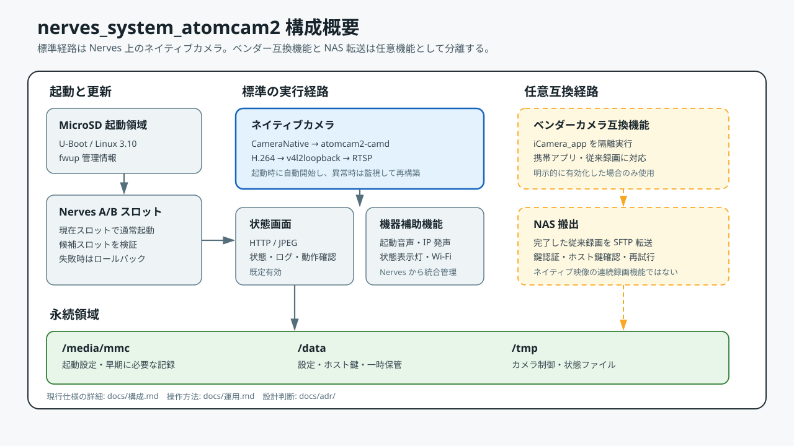

# 構成

`nerves_system_atomcam2` は、Atom Cam 2 固有の起動部品とハードウェア制御部品を
限定して利用し、その後の利用者空間、Elixir アプリケーション、更新、監視を Nerves が
管理する構成です。

## 全体像

```text
Atom Cam 2
  -> U-Boot
  -> 既存の制御カーネルと initramfs
  -> Nerves ブートマネージャー
  -> アプリケーションスロット A または B
  -> Erlang VM と Elixir アプリケーション
       |-- ネットワーク、mDNS、SSH、時刻
       |-- ネイティブカメラと RTSP
       |-- 状態画面と起動案内
       |-- ファームウェア確認
       |-- 任意のベンダー互換機能
       `-- 任意の NAS 転送
```



## 管理範囲

| 対象 | 管理主体 |
| --- | --- |
| 初期起動、制御カーネル、組み込み initramfs | Atom Cam 2 の既存部品 |
| スロット選択、更新候補、ロールバック | Nerves ブートマネージャー |
| root filesystem、Erlang VM、Elixir release | Nerves system とアプリ |
| Wi-Fi、有線 LAN、DHCP、mDNS、SSH、時刻 | Nerves の各サービス |
| ネイティブ映像、RTSP、夜間切替 | `CameraNative` と `atomcam2-camd` |
| 状態画面 | `Dashboard` |
| 標準 Atom アプリ互換、既存録画 | 任意の `VendorCamera` |
| 完了済み録画の NAS 転送 | 任意の `NasExporter` |
| 書き込み可能な状態 | FAT 領域と `/data` |

## 起動と記録媒体

起動時は、既存の制御カーネルから Nerves ブートマネージャーへ処理を渡し、A/B の
いずれかのアプリスロットを選択します。

```text
電源投入
  -> U-Boot
  -> 制御カーネル
  -> 既存 initramfs
  -> Nerves ブートマネージャー
  -> アプリスロット
  -> erlinit
  -> Erlang VM
```

MicroSD の役割は次のとおりです。

| 領域 | 主な内容 | 遠隔更新時の扱い |
| --- | --- | --- |
| パーティション前方 | 二重化した更新情報 | 候補検証後だけ更新 |
| FAT | 起動部品、Wi-Fi、SSH 鍵、機器別設定 | 通常は保持 |
| スロット A | 読み取り専用アプリ | 非稼働時だけ更新 |
| スロット B | 読み取り専用アプリ | 非稼働時だけ更新 |
| `/data` | アプリの永続状態 | 保持 |

SSH ホスト鍵、時刻、Wi-Fi、公開鍵など、`/data` の検査完了前にも必要な状態は FAT に
置きます。その他の継続状態は `/data` に置きます。

## Nerves アプリケーション

主な監視対象は次のとおりです。

```text
Atomcam2NervesApp.Supervisor
  |-- StatusLed
  |-- BootAnnounce
  |-- TimeSync
  |-- FirmwareHealth
  |-- VendorCamera
  |-- CameraNative
  |-- Dashboard.Server
  |-- RtspServer
  |-- NasExporter.SFTP
  `-- NasExporter
```

`VendorCamera`、旧 `RtspServer`、`NasExporter` は互換機能のために残っています。
現在の通常映像は `CameraNative` が直接管理します。

## ネイティブカメラ

ネイティブカメラは現在の標準映像経路です。`CameraNative` が必要なカーネルモジュールを
順序どおりに読み込み、次の処理を監視します。

```text
センサーと ISP
  -> atomcam2-camd
       |-- H.264 エンコード
       |-- JPEG スナップショット
       |-- OSD 状態表示
       `-- 夜間切替
  -> /dev/video0
  -> v4l2rtspserver
  -> RTSP 利用者
```

`atomcam2-camd` は H.264 と JPEG に別のエンコーダーチャンネルを使用します。
状態画面が JPEG を繰り返し取得しても、H.264 のバッファーを直接共有しない構成です。

`CameraNative` は次を行います。

- カメラと音声に必要なモジュールを既知の順序で読み込む
- `atomcam2-camd` と `v4l2rtspserver` を監視する
- RTSP の SDP に復号用情報が含まれるまで健全性を確認する
- 異常が続いた場合に映像経路全体を再構築する
- JPEG の取得頻度を制限し、直近画像を再利用する
- 夜間ビジョン、OSD、実測 FPS を管理する

`/data/atomcam2-native-camera/auto-start.conf` に `enabled=false` を記述すると自動起動を
停止できます。ファイルがない場合は有効です。

## 状態画面

状態画面は `:inets` の HTTP サーバーを使用し、既定で有効です。

```text
GET  /              HTML 状態画面
GET  /healthz       生存確認
GET  /status.json   機械可読な状態
GET  /snapshot.jpg  JPEG
POST /...            管理操作
```

画面は「映像」「状態」「ログ」「動作確認」の四区分です。読み取りは認証なし、管理操作は
HTTP Basic 認証です。利用者名は `admin` で、パスワードが未設定の場合は操作を拒否します。

状態画面は便利な現地確認手段ですが、TLS を提供しません。信頼できないネットワークでは
無効化するか、別の保護された経路の内側で使用します。

## ベンダー互換機能

標準 Atom アプリと既存の録画機能を必要とする場合は、ベンダーカメラ実行環境を任意で
起動できます。必要なファイルを分離した実行環境に配置し、Nerves が管理するネットワーク、
watchdog、再起動、実際の記録媒体を直接変更させない構成です。

この互換環境は安全な隔離領域ではありません。互換性を確保しつつ管理境界を狭めるための
仕組みです。

ネイティブカメラとベンダーカメラは同じハードウェア資源を使用します。両者の同時運用は
保証せず、用途に応じて一方を選びます。

## 録画と NAS 転送

現在のネイティブカメラは連続 MP4 録画を生成しません。既存の一分単位の録画は
ベンダー互換機能から生成されます。

```text
ベンダー互換機能の完了済み MP4
  -> /data の一時保管領域
  -> SFTP で .uploading 名として送信
  -> サイズ確認
  -> 正式名へ変更
  -> 転送済み記録
  -> 容量と保存期間に従って整理
```

転送基盤は実装済みですが、接続先 NAS、権限、保存先、容量、回線断、長時間運用は
利用環境ごとに検証する必要があります。

## ファームウェア更新

遠隔更新では、稼働中ではないスロットへ候補を書き込みます。

```text
確認済みスロット A
  -> 候補をスロット B へ書き込み
  -> 書き込み結果を検証
  -> B を次回候補に設定
  -> 再起動
  -> ヘルスチェック成功: B を確定
  -> 繰り返し失敗: A へ復帰
```

候補の確定では、アプリケーション、`/data`、更新情報、ローカルネットワークを確認します。
インターネット接続は必須条件にしません。

## 障害時の考え方

| 障害 | 動作方針 |
| --- | --- |
| ネイティブ映像処理の停止 | 映像経路を監視し、必要なら再構築 |
| 状態画面の停止 | Nerves、SSH、映像管理は継続 |
| ベンダー互換機能の失敗 | Nerves の基本管理機能は継続 |
| NAS に接続できない | 後で再試行し、未転送ファイルを保持 |
| 更新転送の中断 | 現在のスロットを継続 |
| 更新候補の起動失敗 | 確認済みスロットへ復帰 |
| `/data` の修復失敗 | 暗黙に初期化せず、利用不可として報告 |

この設計は、便利さよりも復旧経路と観測可能な失敗を優先します。

## 関連資料

- [はじめに](はじめに.md)
- [運用](運用.md)
- [設計判断](adr/README.md)
- [ADR 0009](adr/0009-ネイティブカメラを標準映像経路とする.md)
