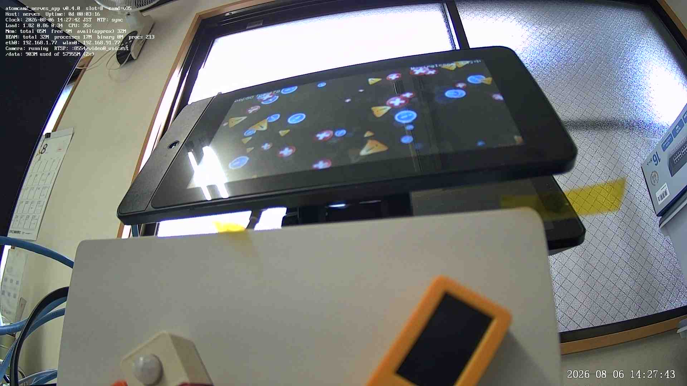

# 運用

この文書は、現行版 `0.5.0` の日常操作と障害時の確認手順をまとめたものです。
過去の作業記録より、この文書を優先してください。

## 接続する

```sh
ssh nerves@nerves.local
```

名前を解決できない場合は IP アドレスを指定します。

```sh
ssh nerves@<機器のIP>
```

IP アドレスが変わる運用では、ルーターの DHCP 予約を設定します。

## 全体状態を確認する

IEx では次を確認します。

```elixir
Atomcam2NervesApp.CameraNative.status()
Atomcam2NervesApp.Dashboard.enabled?()
Atomcam2NervesApp.FirmwareHealth.status()
VintageNet.info()
```

機器上の一般的な確認には Toolshed を利用できます。

```elixir
cmd("uptime")
cmd("free")
cmd("ip address")
cmd("dmesg | tail -100")
```

## 状態画面を使う

```text
http://<機器のIP>/
```

- 映像: JPEG、FPS、夜間切替
- 状態: CPU、メモリ、ネットワーク、映像処理
- ログ: RingLogger の記録
- 動作確認: LED、赤外線、スピーカー、マイク、再起動

機械から状態を取得する場合は `GET /status.json`、単純な生存確認は `GET /healthz` を
使用します。

### 管理用パスワードを設定する

```elixir
Atomcam2NervesApp.Dashboard.set_password("十分に長い固有のパスワード")
```

利用者名は `admin` です。パスワードは `/data/atomcam2-dashboard/password.conf` に
平文で保存され、権限は `0600` です。HTTP Basic 認証にも TLS はありません。
信頼できないネットワークへそのまま公開しないでください。

パスワードを削除すると、書き込み操作を再び拒否します。

```elixir
Atomcam2NervesApp.Dashboard.set_password(nil)
```

状態画面全体を止める場合は次を使用します。

```elixir
Atomcam2NervesApp.Dashboard.enable(false)
```

再び有効にします。

```elixir
Atomcam2NervesApp.Dashboard.enable(true)
```

設定は `/data` に保存されます。

## RTSP 映像を見る

```text
rtsp://<機器のIP>:8554/video0_unicast
```

状態を確認します。

```elixir
Atomcam2NervesApp.CameraNative.status()
Atomcam2NervesApp.CameraNative.camd_version()
```

映像が出ない場合は、次を順に確認します。

1. `phase` が `:running` か
2. `camd_pid` と `rtsp_pid` が設定されているか
3. `8554` 番ポートへ接続できるか
4. 状態画面の JPEG が更新されるか
5. ログに RTSP の健全性失敗がないか

```elixir
cmd("netstat -lnt | grep 8554")
RingLogger.next()
```

`CameraNative` は RTSP の復号用情報まで確認し、異常が続けば映像経路を再構築します。
短時間の再構築中はクライアント側で再接続が必要になる場合があります。

## JPEG を取得する

```elixir
Atomcam2NervesApp.CameraNative.snapshot()
```

成功すると `{:ok, "/tmp/camd.jpg"}` を返します。状態画面の `GET /snapshot.jpg` からも取得できます。
連続要求は直近の JPEG を再利用し、実際の撮影頻度を制限します。

## 夜間ビジョンを切り替える

```elixir
Atomcam2NervesApp.CameraNative.night_vision(:on)
Atomcam2NervesApp.CameraNative.night_vision(:off)
Atomcam2NervesApp.CameraNative.night_vision(:auto)
```

- `:on`: 夜間固定
- `:off`: 昼間固定
- `:auto`: ISP の利得を基準に自動切替

赤外線遮断フィルターだけを試験する場合は、状態画面の動作確認を使用します。

## 映像上の状態表示を切り替える

```elixir
Atomcam2NervesApp.CameraNative.osd_debug(true)
Atomcam2NervesApp.CameraNative.osd_debug(false)
```

設定は `/data/atomcam2-native-camera/osd-debug.conf` に保存されます。



## ネイティブカメラの自動起動を止める

次のファイルを作成します。

```text
/data/atomcam2-native-camera/auto-start.conf
```

内容は次の一行です。

```text
enabled=false
```

再起動後に適用されます。ファイルが存在しない場合は有効です。

## 起動時の音声案内

起動時は、起動音の後に有線と無線の IP アドレスを読み上げます。IP 読み上げだけを
無効にできます。

```elixir
Atomcam2NervesApp.BootAnnounce.ip_announce_enabled?()
Atomcam2NervesApp.BootAnnounce.set_ip_announce(false)
Atomcam2NervesApp.BootAnnounce.set_ip_announce(true)
```

直ちに読み上げを試す場合は次を使用します。

```elixir
Atomcam2NervesApp.BootAnnounce.announce_ip()
```

設定と履歴は FAT 領域へ保存されます。

```text
/media/mmc/ip-announce-enabled
/media/mmc/boot-announce-history.log
```

## 複数拠点の Wi-Fi を登録する

FAT 領域の `nerves-provisioning.conf` に追加します。

```text
NERVES_WIFI_SSID=home
NERVES_WIFI_PASSPHRASE=home-secret
NERVES_WIFI_SSID_2=office
NERVES_WIFI_PASSPHRASE_2=office-secret
NERVES_WIFI_SSID_3=lab
NERVES_WIFI_PASSPHRASE_3=lab-secret
```

設定済みのうち、到達できる無線網へ接続します。空のパスフレーズは開放型の無線網として
扱われます。

有線 LAN と Wi-Fi を同時に利用できる場合は、有線を優先します。

## SSH ホスト鍵の警告を解消する

MicroSD の再作成や IP アドレスの再利用後、既知のホスト鍵と一致しない場合があります。
対象が正しい機器であることを確認してから、古い記録を削除します。

```sh
ssh-keygen -R <機器のIP>
ssh-keyscan -H <機器のIP> >> ~/.ssh/known_hosts
```

## ファームウェアを遠隔更新する

サンプルアプリのディレクトリで実行します。

```sh
export MIX_TARGET=atomcam2
export MIX_ENV=prod

mix firmware
mix upload <機器のIPまたはnerves.local>
```

更新後は候補スロットで再起動し、ヘルスチェックの完了後に確定します。

```elixir
Atomcam2NervesApp.FirmwareHealth.status()
```

大量の映像処理や互換カメラを動かしている場合は、更新前に停止して負荷を下げる運用が
安全です。

## 確認済みファームウェアへ戻す

現在の候補が起動を繰り返して失敗した場合、ブートマネージャーが確認済みスロットへ
戻します。手動操作が必要なときは、作業前に現在のスロットと更新情報を記録し、
[ADR 0006](adr/0006-安全な更新とロールバックを行う.md) と関連作業記録を確認します。

## 記録媒体を復旧する

MicroSD を開発機へ接続し、対象機器を確認します。

```sh
lsblk /dev/sdX
```

ファームウェア全体を書き直す場合は次を使用します。

```sh
sudo fwup -a -i <ファームウェア>.fw -t complete -d /dev/sdX
```

`/data` のファイルシステム署名が壊れており、内容を破棄して作り直す判断をした場合だけ、
対象パーティションを十分に確認してから署名を消します。

```sh
sudo wipefs -a /dev/sdX4
```

この操作は `/data` を失います。復旧前に可能な範囲で複製を取得してください。

## ベンダー互換機能を使う

標準 Atom アプリや既存録画が必要な場合だけ使用します。ネイティブカメラとの同時運用は
保証していないため、先にネイティブカメラを止め、再起動後に互換機能を有効にする手順を
採用してください。

初回準備と手動起動の基本形は次のとおりです。

```elixir
cmd("atomcam2-vendor-camera precheck")
cmd("atomcam2-vendor-camera prepare")
cmd("atomcam2-vendor-camera start")
cmd("atomcam2-vendor-camera status")
```

停止します。

```elixir
cmd("atomcam2-vendor-camera stop")
```

カメラ用モジュールの状態が残るため、別のカメラ経路へ切り替える前に再起動します。

## NAS 転送を検証する

NAS 転送は、ベンダー互換機能が生成した完了済み MP4 を対象とします。ネイティブカメラは
現在、連続録画を生成しません。

設定ファイルは次です。

```text
/data/atomcam2-vendor-camera/nas-export.conf
```

設定例です。

```text
enabled=true
host=nas.local
port=22
user=atomcam2
user_dir=/data/atomcam2-vendor-camera/nas-ssh
remote_directory=recordings/atomcam2
poll_interval_seconds=60
retention_days=20
max_spool_bytes=536870912
```

運用前に次を確認します。

- 専用の SFTP 利用者と保存先を用意する
- 秘密鍵と `known_hosts` を `user_dir` に配置する
- NAS 側の権限を保存先へ限定する
- 一時名から正式名への変更と再試行を確認する
- 未転送ファイルが容量上限で削除されないことを確認する
- 保存期間による削除対象を確認する
- 回線断、NAS 停止、再起動、長時間運転を試す

状態と即時実行は次のとおりです。

```elixir
Atomcam2NervesApp.NasExporter.status()
Atomcam2NervesApp.NasExporter.SFTP.status()
Atomcam2NervesApp.NasExporter.run_now()
```

詳細な未完了項目は
[遠隔録画の検証計画](worklog/20260806-遠隔録画の検証計画.md)を参照してください。
